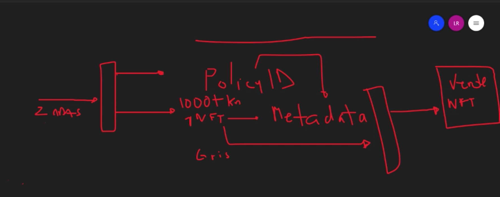
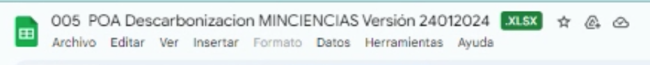

# Reunion 16 de Abril 2021
- Modelo de negocio
- Contrato usan un smart contract

# Normas contables
- NIC38; activos o patriminio, propiedad intelectual

# 21 de Abril

## Captación de Activos
- https://www.supersociedades.gov.co/Noticias/Publicaciones/Documents/2018/ABC-captacion-DEFINITIVO-2018.pdf
- https://actualicese.com/captacion-ilegal-de-recursos-y-actividades-no-autorizadas/#:~:text=Algunos%20ejemplos%20de%20formas%20de%20captaci%C3%B3n%20ilegal%20de%20dinero%20son,tienen%20una%20explicaci%C3%B3n%20financiera%20razonable.

### Tareas
- Documentar 


PROYECTO TOKENIZACIÓN DE ACTIVOS FORESTALES
```txt
Desarrollo experimental de prototipo de plataforma mínima viable para la prueba de concepto de la tokenización de activos forestales a través de encargos fiduciarios, a través de contratos digitales y tokenización de activos forestales como cultivos de pino caribe, democratizando el acceso a la propiedad de árboles y su respectivo terreno, como una solución al calentamiento global, brindado la posibilidad a cualquier ciudad del mundo que invierta en árboles para la captura de CO2, en un posible sistema de criptomonedas forestales.
```


# 16 Octubre Luis

- Se crean NTFs para cada estado y se destruye el anterior



- Primer fase lo haremos manual, para entender 
- Reproducir en código el paso a paso
- Se crea y se destruye NFT en el tiempo

# Lui Enrique 25/10/21
## CIF poder acceder (Cerfiticado Incentivo Forestal)
- No todas las fincas son 
- UPRA Unidad planificacion agraria, aptitud forestal, visor CIPRA (Potenciales SIG)
- No bosque natural
- Plante, un morichal, le cubren el 20%, no es mucho, por hectarea $ COP 80.000
- Modelos de captura en Colombia, es diferente en cada pais, cambia por región
- Análisis area, refraccion de la luz, cada 1 año o 2 años, revisar

## Proceso CIF 

1. Certificado de tradicion y libertad, sino tiene no sirve
2. Ninguna medida cautelar
3. CIPRA apto, coordenadas es favorable medio/alto
4. Analisis de suelos
5. Levantamiento del area
6. Nutricional
7. Cual especie se acomoda mas para ese terreno
8. 

## Plan Establecimiento y Manejo Forestal (PEM); actividades del proyecto
- Donde se compra la semilla
- Donde Vivero
- Preparacion del suelo, arado o no
- 3m 
- Mantenimiento 


1'200.000 hectareas

## 1er proyecto
- 2000 hectareas
- Entre Meta / Vichada  
- 

## Regiones mayor potencial
- Vichada, Meta, Casanera, Cordoba, Antioquia


# Reunion 04 Noviembre 2021

## Puntos
- Partimos 
- Que tenemos actualmente?
- Reunión MVP
  - Viabilidad otras Block
  - Procesos para los estados de los tokens
- Cuales son los entregables de cada uno de nosotros, para que se?
- Un proyecto se puede financiar con bonos de carbono futuros?
- Habiamos dicho que en tres meses


## Contrato de fundadores
- Cap Table
- Seguridad juridica
- Cualquier elemento hacer parte PI
- Bad liver: condiciones
- Good liver: condiciones


# 12 de Noviembre 2021

Referencias
- https://www.topl.co/
- Rosseta: blockchain
- Polygon
  
# Contexto 

- Primero reunión creo que fue en enero 
  - Canabis, mejor producción de canabis
  - Activos forestales

- Reunion conseguir recursos (ecopetrol en compañia, )

- Reuniones de los avances

- Reunion en OMA (Agora o Horus como prestadora de servicios de )

- Reunion telefonica donde plantee mi parte 25/2 Robin/Luis

- Constanza y Sandra EU

- No se cumplió o se llego a algun acuerdo respecto Agora Horus

- Se comienza 

# Acuerdo de porcentajes / PI
- PI
- 

# Angeles


# Ejercicio SUANCOS

# Estado de arte


# Big Data Architecture

1. Almacenamiento centralizado S3: es la fuente principal donde se guarda y consumen los datos
2. Preprocesamiento y tranformación de datos: procesamiento y tranformación de los datos crudos  y almacene datos de una amplia variedad de fuentes en una plataforma centralizada.
3. Procesamiento y analítica: Integre rápidamente herramientas de procesamiento de datos de terceros actuales y futuras.
4. Sguridad y gobernabilidad: Comparta de forma segura conjuntos de datos y resultados procesados. 
5. Catálogo y Administración: Cree un catálogo de datos completo para buscar y utilizar activos de datos almacenados en el lago de datos.

# Marzo 06 2023
## Como funcionan la mayoría de servicios: SaaS

Seguridad (SSO)
Costos
Mantenibilidad
Aprovisionamiento
Alistamiento
Despliegue

- Imagenes satelitales
- Ux/Ui grimo
-


Dos persona
Sergio Cajias (Jr)
Descarnonización 

- 

N4na
Acuabox
005 
SUAN


- Negocios
- Hitos
- Ui/Ux
- Microservicios


react
nextjs
shellscripting


Ejemplo, versionamiento de T&C


# April, 17 2024


# 1.4 IoT (Trazabilidad)
- Avance 38% a marzo
- Hoja de vida del arbol
- Metodos comparativos
- Drones (stopper la compra)

## Solución
- @sergio, variales a considerar fitosanitarios
- Data Lake @robin
- Datos simulados @robin
- Reportes @robin
- Imágenes satelitales
- Oracle, avance temas satelites
- Analisis banda 1, 2 y 3
- Algoritmo de AI, que nos permita hacer algunas mediciones. Fotos de google cultivos historicos y hacer la simulación @robin
- todo lo esta linkeado en el excel

## POA a nivel de informe

- Anexos transversal
- Conectar con un documento

# 2.1
- Plataforma
- Marketplace


# 2.2 Desarrollar contratos inteligentes
- Implementación del light-paper
- En Mayo inicia la promoción, @camilo


# April, 19 
- @emanuel, estructurar los entregables, listado de lo que tenemos que entregar


# April, 26

## Simulador
- Protocolos: MQQT,  Modbus, Modbus TCP

## Grupo de trabajo de ciencia de datos
- Servicios de Google cloud
- Migración custodia de SUAN
- Integración y migración
- Finales de mayo
- Postgres

## Requerimiento propio
- Cual parte de la información se va a subir a la blockchain?
- Información estructurada en un BD, que se va a ver reflejado 1.4.x es el 10% de un 40%
- 42% del proyecto esta bajo nuestra responsabilidad


## @emanuel
- Listado limpio de los avances del mes. Ej: manual de uso de la herramienta
- Por linea, tener un documento
- 2.1 y 2.2, entregable global para darle visto a la actividad. Ej. manual de usuario. Con el fin de distribuir con su respectivo responsable.
- Ej. Definir la tasa..: quien es el responsable


# Mayo 8, 2024
- Alvaro Spitia, comercio internacional
- Regulacion Europea, SIBAN. Exige compensación de carbono CBAM
- Que tiene que hacer el país

- Wocan, enfoqye de genero
- https://www.apple.com/co/newsroom/2019/04/conserving-mangroves-a-lifeline-for-the-world/

## Relative CBAM Exposure Index
- https://www.worldbank.org/en/data/interactive/2023/06/15/relative-cbam-exposure-index
