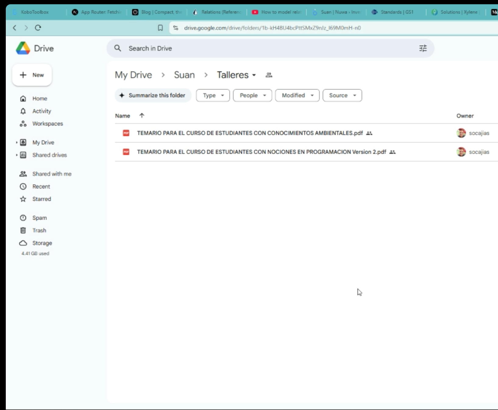

# Reuniones

## Reunion 16 de Abril 2021

- Modelo de negocio
- Contrato usan un smart contract

## Normas contables

- NIC38; activos o patriminio, propiedad intelectual

## 21 de Abril

### Captación de Activos

- <https://www.supersociedades.gov.co/Noticias/Publicaciones/Documents/2018/ABC-captacion-DEFINITIVO-2018.pdf>
- <https://actualicese.com/captacion-ilegal-de-recursos-y-actividades-no-autorizadas/#:~:text=Algunos%20ejemplos%20de%20formas%20de%20captaci%C3%B3n%20ilegal%20de%20dinero%20son,tienen%20una%20explicaci%C3%B3n%20financiera%20razonable.>

#### Tareas

- Documentar

PROYECTO TOKENIZACIÓN DE ACTIVOS FORESTALES

```txt
Desarrollo experimental de prototipo de plataforma mínima viable para la prueba de concepto de la tokenización de activos forestales a través de encargos fiduciarios, a través de contratos digitales y tokenización de activos forestales como cultivos de pino caribe, democratizando el acceso a la propiedad de árboles y su respectivo terreno, como una solución al calentamiento global, brindado la posibilidad a cualquier ciudad del mundo que invierta en árboles para la captura de CO2, en un posible sistema de criptomonedas forestales.
```


## 16 Octubre Luis

- Se crean NTFs para cada estado y se destruye el anterior


- Primer fase lo haremos manual, para entender
- Reproducir en código el paso a paso
- Se crea y se destruye NFT en el tiempo

## Lui Enrique 25/10/21

### CIF poder acceder (Cerfiticado Incentivo Forestal)

- No todas las fincas son
- UPRA Unidad planificacion agraria, aptitud forestal, visor CIPRA (Potenciales SIG)
- No bosque natural
- Plante, un morichal, le cubren el 20%, no es mucho, por hectarea $ COP 80.000
- Modelos de captura en Colombia, es diferente en cada pais, cambia por región
- Análisis area, refraccion de la luz, cada 1 año o 2 años, revisar

### Proceso CIF

1. Certificado de tradicion y libertad, sino tiene no sirve
2. Ninguna medida cautelar
3. CIPRA apto, coordenadas es favorable medio/alto
4. Analisis de suelos
5. Levantamiento del area
6. Nutricional
7. Cual especie se acomoda mas para ese terreno

### Plan Establecimiento y Manejo Forestal (PEM); actividades del proyecto

- Donde se compra la semilla
- Donde Vivero
- Preparacion del suelo, arado o no
- 3m
- Mantenimiento

1'200.000 hectareas

### 1er proyecto

- 2000 hectareas
- Entre Meta / Vichada  

### Regiones mayor potencial

- Vichada, Meta, Casanera, Cordoba, Antioquia

## 04 Noviembre 2021

### Puntos

- Partimos
- Que tenemos actualmente?
- Reunión MVP
  - Viabilidad otras Block
  - Procesos para los estados de los tokens
- Cuales son los entregables de cada uno de nosotros, para que se?
- Un proyecto se puede financiar con bonos de carbono futuros?
- Habiamos dicho que en tres meses

### Contrato de fundadores

- Cap Table
- Seguridad juridica
- Cualquier elemento hacer parte PI
- Bad liver: condiciones
- Good liver: condiciones

## 12 de Noviembre 2021

Referencias

- <https://www.topl.co/>
- Rosseta: blockchain
- Polygon
  
### Contexto

- Primero reunión creo que fue en enero
  - Canabis, mejor producción de canabis
  - Activos forestales

- Reunion conseguir recursos (ecopetrol en compañia, )

- Reuniones de los avances

- Reunion en OMA (Agora o Horus como prestadora de servicios de )

- Reunion telefonica donde plantee mi parte 25/2 Robin/Luis

- Constanza y Sandra EU

- No se cumplió o se llego a algun acuerdo respecto Agora Horus

- Se comienza

### Acuerdo de porcentajes / PI

- PI

### Angeles

### Ejercicio SUANCOS

### Estado de arte

### Big Data Architecture

1. Almacenamiento centralizado S3: es la fuente principal donde se guarda y consumen los datos
2. Preprocesamiento y tranformación de datos: procesamiento y tranformación de los datos crudos  y almacene datos de una amplia variedad de fuentes en una plataforma centralizada.
3. Procesamiento y analítica: Integre rápidamente herramientas de procesamiento de datos de terceros actuales y futuras.
4. Seguridad y gobernabilidad: Comparta de forma segura conjuntos de datos y resultados procesados. 
5. Catálogo y Administración: Cree un catálogo de datos completo para buscar y utilizar activos de datos almacenados en el lago de datos.

## Marzo 06 2023

### Como funcionan la mayoría de servicios: SaaS

Seguridad (SSO)
Costos
Mantenibilidad
Aprovisionamiento
Alistamiento
Despliegue

- Imagenes satelitales
- Ux/Ui grimo
- Dos persona
- Sergio Cajias (Jr)
- Descarnonización
- N4na
- Acuabox
- Negocios
- Hitos
- Ui/Ux
- Microservicios
- react
- nextjs
- shellscripting
- Ejemplo, versionamiento de T&C

## April, 17 2024

### 1.4 IoT (Trazabilidad)

- Avance 38% a marzo
- Hoja de vida del arbol
- Metodos comparativos
- Drones (stopper la compra)

### Solución

- @sergio, variales a considerar fitosanitarios
- Data Lake @robin
- Datos simulados @robin
- Reportes @robin
- Imágenes satelitales
- Oracle, avance temas satelites
- Analisis banda 1, 2 y 3
- Algoritmo de AI, que nos permita hacer algunas mediciones. Fotos de google cultivos historicos y hacer la simulación @robin
- todo lo esta linkeado en el excel

### POA a nivel de informe

- 
- Anexos transversal
- Conectar con un documento

### 2.1

- Plataforma
- Marketplace

### 2.2 Desarrollar contratos inteligentes

- Implementación del light-paper
- En Mayo inicia la promoción, @camilo

## April, 19

- @emanuel, estructurar los entregables, listado de lo que tenemos que entregar

## April, 26

### Simulador

- Protocolos: MQQT,  Modbus, Modbus TCP

#### Grupo de trabajo de ciencia de datos

- Servicios de Google cloud
- Migración custodia de SUAN
- Integración y migración
- Finales de mayo
- Postgres

### Requerimiento propio

- Cual parte de la información se va a subir a la blockchain?
- Información estructurada en un BD, que se va a ver reflejado 1.4.x es el 10% de un 40%
- 42% del proyecto esta bajo nuestra responsabilidad

### @emanuel

- Listado limpio de los avances del mes. Ej: manual de uso de la herramienta
- Por linea, tener un documento
- 2.1 y 2.2, entregable global para darle visto a la actividad. Ej. manual de usuario. Con el fin de distribuir con su respectivo responsable.
- Ej. Definir la tasa..: quien es el responsable

## Mayo 8, 2024

- Alvaro Spitia, comercio internacional
- Regulacion Europea, SIBAN. Exige compensación de carbono CBAM
- Que tiene que hacer el país
- Wocan, enfoqye de genero
- <https://www.apple.com/co/newsroom/2019/04/conserving-mangroves-a-lifeline-for-the-world/>

### Relative CBAM Exposure Index

- <https://www.worldbank.org/en/data/interactive/2023/06/15/relative-cbam-exposure-index>

## Mayo 14, 2024

- Enfasis en los entregables contractuales
- Dataset
- Dashbaoard
- Procedimiento @ignacio
- Light paper

## Mayo 16, 2024

### KYC

- Ver pivotal, hay dos links
- Lo provee un 3ro o lo implementamos
- Bellarine
- Truora
- proceso de cruzar el usuario con pruebas especificas (existencia). Ejemplo un servicio de agua,
- Cumplir un minimo, de regulación
- SARLAF
- <https://aws.amazon.com/es/solutions/financial-services/identity-verification/>
- Benchmak

### Hoja de ruta

1. Esceario offfline
2. KYC

- WS pruebas con Selenium FE
- Servicios de documentación
- Servicios de incidencias: Formulario => Pivotal traker =>

## 21 de Mayo, 2024

### Robin

- Data Lake (update)
- Data Set (update)
- Problem handling (new)
- Workshops, data lake: Ejecutar agenda de promoción de negocio

### Sergio

- Requerimientos
- Diseño del sistema

## 31 de Mayo, 2024

- Explorar herramientas para graficar
- Stream Lead
- Tablue
- AWS IoT analytics
- Integración con marketplace y plataforma
- ReactChart JS

## 04 Junio, 2024

### Investigación benchmark BI

- Prompted what are the top 5 BI in the market?
- Microsoft Power BI, Tableau, Looker Studio, Qlick sense
- No soportan parquet (Looker, Tabue)
- Microsoft Power BI, si soporta parquet

#### Pricing

##### Microsoft Power BI

- Power BI Pro: Starts at $9.99 per user/month.
- Power BI Premium: Offers dedicated capacity and starts at $4,995 per month.
- Power BI Premium Per User: A new option that starts at $20 per user/month.

##### Tableau

- Tableau Creator: Starts at $70 per user/month.
- Tableau Explorer: Starts at $42 per user/month.
- Tableau Viewer: Starts at $15 per user/month.

##### Looker Studio (formerly Google Data Studio)

Looker Studio is free to use for connecting to a limited number of data sources and creating basic reports and dashboards.
For more advanced features and integrations, you'll need to upgrade to Looker, which has custom pricing based on your specific needs.

- Doesn't support parquet or json directly, is neccesary use third party
- Example Neider: <https://lookerstudio.google.com/reporting/91cf20ab-b74a-48cb-821f-1db47763699f/page/NawjD>

###### Embedding

- Embed: <https://cloud.google.com/looker/docs/embed-overview>
- Frame: <https://cloud.google.com/looker/docs/extension-framework-react-and-js-code-examples>

##### Qlik Sense

- Qlik Sense Business: Starts at $30 per user/month.
- Qlik Sense Enterprise: Contact Qlik for a custom quote based on your requirements.

- Cual es el presupuesto de infraestructura
- Librer
- Crea

##### Databricks

- Apache
- Pay as you go
- <https://www.databricks.com/product/pricing>
- What is Databricks used for?

> Data Engineering: ETL processes, data pipelines, data cleaning, and transformation.
> Data Science: Exploratory data analysis, feature engineering, model development, and experimentation.
> Machine Learning: Model training, hyperparameter tuning, model deployment, and monitoring.
> Analytics: SQL queries, dashboards, and reporting.
> Business Intelligence: Self-service analytics, interactive dashboards, and data exploration.

##### Quicksight

- Los costos en aws
- Ticket

## Librerias UI

- Recharts
- Dj3
- Cuales serían dashboards?

### Entrenamiento para el equipo

- Presupuesto

### Problem handling

- Intregración con telegram
- Serverless app

## 05 de Junio, 2024

- Lluvia de ideas
- Mockup del dashboard
- Indicadores, metas (target)
- Dashboard 1.4.x

## 27 Junio, 2024

- Integración 3ros
- Luis Gómez
- Data
- Material de prueba, páginas de terrasacha
- No enlazar todos los documentos que no se trabajaron, que no hayan cambios

### Soluciones Transversales

- Problema handling, creación de tiquet
- Gestión de documentación (TyC, Acuerdo de confidencialidad)

### Transferencia de conocimiento

- Como esta hecha la plataforma
- ML/AI
- Costos de almacenamiento para 200 GB, raster 2GB
- Imágenes hyper-espectrales
- Conectividad
- Energía
- Conectividad
- Solo montar lo que se hizo
- Quitar enlaces de anexos
- Internet satelital
- Equipos robustos

### 8 de Julio, 2024

1. Automatizacion de pruebas, selenium
2. Terrasacha
3. Tickets
4. Timeouts
5. Compartir  arquitecto SQS
6. Pruebas de estres en serverless, a nivel de compras concurrentes Container Service de autoescalarce (autoescalamiento, balanceo de cargas) apprunner
7. Encolamienta de tareas
8. Requests muy demorados
9. Monitorear tareas
10. Sidekick dcoker simil para AppRunner

### 11 de Julio, 2024

1. Prueba de SQS
2. Prueba EKS (50 usuario, enviando el mismo end-point), toma 1 minuto. API de SQS (Lunes)
3. Informe mensual Doc: Analisis de datos 2.1.7, (Realizar analisis de datos para la evaluación y ajuste)

### 16 de Juio, 2024

1. Quien es el grupo objetivo?
2. Si ya estuvo la intro, cuales serían los temas a tratar
3. Desde cero, blockchain
4. Cuanto tiempo es? (2 horas la vez pasado)
5. Visita Meta (historias a mejorar)
6. Colores

### 17 de Julio, 2024

1. 14:00
2. Personas de diferentes disciplinas
3. Simulacro
4. PCI: 5 personas, Camilo 10 personas

Intro: Robin
Plataforma: Neider, usando algunos de los proyectos ya creados <https://test-platform.suan.global/>
@Neider cuando se están llenando los periodos del token y otras configuraciones: @Sebastian Azcona, validaciones (financiera, tecnica, ingresos producto, indicadores, flujo de caja etc)
@Ignacio Markertplace <https://test-marketplace.terrasacha.com/home>
@Ignacio y @Neider P2P

#### 18 Julio, 2024

- Presentación
- Viviana: Quien debe ser el administrador?
- Modelo del negocio, revisión de datos personales
- Politica lavado de activos
- La comunidad: stakeholders, P2P, profesos de certificación, y otros
- Talleres de comunidad, como ellos ven y gestionan los tokens
- @viviana Como puede participar? cómo la comunidad hace parte de los flujos? Rta: La comunidad: Para las sesiones deviarla a que el objetivo es evaluar la aplicación. Mecanismos de vista a tecnología, a como el equipo de Carlos Soto involucrarla. Es un proceso nuevo y que se esta estableciendo.
- Cómo se hace se envia a una Wallet en especifico, visualización. UI basado en los BC y mostrará

## 19 Julio, 2024

- Social media y diseño
- Cuidado con el manejo de las marcar, transiciones SUAN => Terra Sacha. R/ta: Brusco el cambio. A la universidad solo mostrarle terra sacha. A nivel de registro SUAN. Los inversionistas no ven esa transición.
- Chatbot, para usabilidad.
- Canal de atención directo.
- Dar acceso al manual de usuario, para.
- Seguimiento, cada cuenta? Carlos Soto acompañamiento.
- Canales, mensajes de text SMS para la retroalimentación.

1. Automatizacion de pruebas, selenium
2. Terrasacha
3. Tickets
4. Timeouts
5. Compartir  arquitecto SQS
6. Pruebas de estres en serverless, a nivel de compras concurrentes Container Service de autoescalarce (autoescalamiento, balanceo de cargas) apprunner:

- Encolamienta de tareas
- Requests muy demorados
- Monitorear tareas
- Sidekick dcoker

## 20 Julio, 2024

- Tercer market place, hacer un despliegue (dominios, logos). Modular. @ignacio
- Plataforma (suan)
- Documentación entregables
- Las presentaciones hagan parte de la documentación que puedan acceder
- Informe mensual Doc: Analisis de datos 2.1.7, (Realizar analisis de datos para la evaluación y ajuste) (Telegram chatbot)
- [x] Documentación Julio

```js
// Test on b
dataResults['ResultSet']['Rows']

// "devicevalue"
dataResults['ResultSet']['Rows'].map(row => { return row.Data[0]})

// "epoch_time"
dataResults['ResultSet']['Rows'].map(row => { return row.Data[3]})

// Getting 
epoch_time_array = dataResults['ResultSet']['Rows'].map(row => { return row.Data[3].VarCharValue})
epoch_time_array.shift()

// Ascending order https://www.geeksforgeeks.org/how-to-sort-an-array-in-typescript/
epoch_time_array_asc_order = epoch_time_array.sort((a, b) => a - b);

```

```js
dataIoT = dataResults['ResultSet']['Rows']


temperature_filtered_array = dataResults['ResultSet']['Rows'].filter(
        (row) => row.Data[2].VarCharValue === "Temperature"
      );

temperature_array = dataResults['ResultSet']['Rows'].map(row => { 
  if (row.Data[1].VarCharValue === 'Temperature') {
    return row.Data[3].VarCharValue
  }
})
  
temperature_array = dataResults['ResultSet']['Rows'].map(row => { 
  if (row.Data[].VarCharValue.length > 1 ) {
    return row.Data[3].VarCharValue
  }
})

temperature_array = dataResults['ResultSet']['Rows'].map(row => { 
  console.log('## 0, value: ', row.Data[0].VarCharValue)
  console.log('## 1, SB: ', row.Data[1].VarCharValue)
  console.log('## 2:, Type', row.Data[2].VarCharValue)
  console.log('## 3:, Epoch', row.Data[3].VarCharValue)
  return row.Data[3].VarCharValue
})

temperature_epoch_array = []
temperature_value_array = []
temperature_array = dataResults['ResultSet']['Rows'].map(row => { 
  if (row.Data[1].VarCharValue === 'Temperature') {
    temperature_epoch_array.push(row.Data[3].VarCharValue)
    temperature_value_array.push(row.Data[0].VarCharValue)
    return row.Data[3].VarCharValue
  }
})

```

<https://medium.com/@hikmahx/creating-customized-graphs-with-chart-js-in-react-be72bb2ffd0>
<https://codesandbox.io/p/sandbox/weathered-rain-pvwsnp>

## 24 Julio, 2024

- Duckdb, SQLite cliente
- Encolamiento
- Presentaciones

## 29 de Julio, 2024

- 2.2 Lighpaper, pasar a diseño de token
- Ingenieria de tokens
- Design thinking (necesidades), desde el punto de vista del usuario
- Lluvia de ideas para el diseño del token
- [x] creación usuario Eduardo

## 30 de Julio, 2024

- Nuevo lightpaper: <https://docs.google.com/document/d/1AML0C56f3JUz7GvgwzSHgzpR5H2OFPZt2RiA6Hxp9qQ/edit?usp=sharing>

## 31 de Julio, 2024

- Publico: validadores
- William: Stakeholders son lo vecinos al proyecto, afectados pos/neg. Se presta para confusión. Por definición que esta relacionado con el proyecto. Mejor usar la palabra "Participante"
- William: verra, goldstandar, codigos unicos para su trazabilidad: Token de propiedad, representa una participación en el proyecto. Una promesa a futuro, tiene ID única politca única y especifica, no se puede emitir el mismo unica, politica monetarioa se garantiza. Token de propiedad se transforma en token de utilizad con su propia política y contrato. Incluir, en la presentación éste proceso.
- Ricardo: glosario, validador: entidad operacional o usuario macro, validador interno, usar glosario.
- Ricardo: en que momento como empresa, en que momento se da de baja. Para que no sea de doble contabilidad.
- Carlos Soto: validación para fase inicial, es interna.
- Persona: usuario final (ecopetrol, avianca). Inversion crecimiento del token, para darle de bajo. Biocarbon.
- Jose Ricardo: Darle de baja cuando ya el gobierno, antes se puede transar. Base digital Cómo se la de de baja? <https://market.climatetrade.com/projects/es/forestry-restoration-in-productive-and-biological?id=589>
- Sebastian Azcona: tener en cuenta teniendo en cuenta: resina, madera etc. Token por producto. Comercialización a sanear el flujo.

## 1 de Agosto, 2024

- Agregar en la presentación los tipos de tokens y evolución.
- Validador, validación, chequeo. Interacción.
- Viabilidad financiera.
- Dar de baja, que no se puedan vender en el mercado.
- Confiar en el broker, que realmente lo queme (contrato inteligente)
- Agendar reunión con Jose Ricardo, pero antes probar: <https://market.climatetrade.com/projects/es/forestry-restoration-in-productive-and-biological?id=589>
- Agenda de promoción: porcentaje de avance

## 5 de Agosto, 2024

## 13 de Agosto, 2024

- Los tokens cambian de color: gris inicial, verde otro estado
- No van a ver suancos? solo los tokens
- Jueves, chat de PH

## 14 de Agosto, 2024

### Seguridad

- Gestor de documentos
- Implementar MFA
- AWS WAF and Shield
- PQR, usamos telegram
- AWS Guard Duty

## 15 de Agosto, 2024

- Auditoria, estructuración y estandarización del código con Eduardo (Ignacio, Eduardo, Neider y Rances)
- FAQ, User bot

## 16 de Agosto, 2024

- Merge del trabajo de Eduardo
- General purpose buckets

## 20 de Agosto, 2024

- [ ] @robin Agregar en la presentación plataformas y marketplaces (UCC, Distrital)
- [ ] @robin Agregar en la presentación tipos de Tokens
- 1.4 ITO Sofware, @luis nos comparte el documento. Geomapas, se integraron a los datos IoT Core. Luis les mostro nuestro avance.
- 2.1.1 Manual de usuario @ignacio, actualización de agosto. Detalle en el proceso de pago ePayco. @Rances, mayor detalle
- 2.1.1 @neider, mejorar los flujos donde se muestra el proceso de actualización de los Tokens. Actualizar la arquitectura con multiplicidad de marketplaces. Encolamiento (qeues). @Ignacio actulización (Manual de usuario), incluir la core-wallet
- 2.1.6 Talleres internos, donde se incluyo. Grabación de taller @sergio, el martes incluir el que se va hacer. Incluir el de PH.
- 2.1.7 HUs @luis 2.1.9 vr los talleres que se cubrió.
- 2.2.6 @luis
- 2.2.8 @luis
- Gestor de documentos: 2.1.2

## 23 de Agosto, 2024

- Pitfalls seguridad
- Accesos, less privilegies, acceso consola
- Roles amplify:
- SSO:

## 26 de Agosto, 2024

## 5 Septiembre, 2024

- Cuenta de AWS para UCC
- Cuenta de github codigo abierto para UCC
- Minimo acceso a los usuarios
- Encriptar BD de dynamo
- Encriptar BD de S3
- Mostrar la información de los postulantes, explicitamente solo la puede revelar si lo autoriza el titular
- Rotar API keys (mes)
- SSO
- 2.1.2 Implementar ... legal docs para le entrega de septiembre

## 16 septiembre, 2024

- Investigación el estandar de biocarbon(entre certificador) y verra

### Comercializar bonos de carbono

- Tucan, proyectos
- Casos de éxito de descarbonización, hay un documento de exploración
- Logramos el primer caso de tokenización?
- Literatura, identificar los modeles, juridico, técnico. Actualizar. Jose Ricardo, Paola y Jhony, Europa, Arabia Saudita
- Buscar el norte, antes del miercoles.
- Revisión sistematica, documento tecnico, lineamiento, para publicar en un articulo, como referente
- MVP final de año

## 30 Septiembre, 2024

### Gestión de fallas

- Integración lex chat bot, telegram
- correo
- Multiidioma
- carga de  archivos
- Google collab S3

### Gestión de documentos

- Diseño BD
- API
- Ux/UI

### Victor Hugo

- Como se almacenan
- Información por proyecto
- Visita de campo
- Conglomerado de la parcelas
- GIS drones, 100/200 GB resolución de 15 centimetros. Mavic 3 multiespectral. Los procesados en datos. Reconstrucción de la capa.
- Orto mosaico RGB, mapa de elevación, son lo que tienes utilidad son para publicar
- Ya se tiene: Julio, Agosto y Septiembre
- Hay que entregar 6 proyectos
- Se van adquirir drones de ala fija, camara multiespectrl, LIDAR hay que procesalos y generar la capa, capas asociadas al poligono correspondiente
- 1.4.x Protocolo por capas por sensor, se va hacer en sitio
- 1.4.x ciclo de vida
- enero, febrero llegan los drones
- Puerto lopez parcela diametro, alturas, falta de comunicación con las actividades de campo. Estudios de prefactibilidad.
- Jose Ricardo, esta articulado. Sotelo no.
- Jhonny nos muestre que tenemos
- Financiero Azcona, Victor no se entiende el modelo. 100 pestañas, donde salieron los numeros, diferenciación de años, modelo que lo soporta. Documento técnicos de soporte, cómo se hizo el cálculo. Indicadores de gobierno, alimenta el modelo. Cómo proyecta el TIR?
- Avanzar a nivel de datos
- Framework: 10 páginas, Marco general teorico, conceptual y digerible. Solución completa. Basado en el documento que va a compartir Victor <https://www.researchgate.net/publication/345634620_Blockchain_A_Theoretical_Framework_for_Better_Application_of_Carbon_Credit_Acquisition_to_the_Building_Sector> Documento, técnico científico
- 1.4x. Compartir con Victor un S3 para el 1er proyecto, o crear una web para que suban los archivos
- Smart contracts, inconvenientes jurídicos y filosóficos
- Vigilacia competitiva

## 14 Octubre, 2024

### Benefiario y elegibles

- Cómo es la participación de la comunidad. El proceso en manual. Depende del numero de personas
- Con Viviana, con el protocolo de bioetica. Se van a inscribir muchos. Lo 6 prefactibilidad, desarrollar el modelo.
- Beneficiarios y eligles con filtros operativos
- Esta llegando mucha gente
- Como me vuelvo beneficiario
- Una ruta clara de priorización, @viviana
- Ruta clara de selección
- Código único de redimible
- Procuraduría: Cómo esta priorizando la lista de beneficiarios?
- Desde plataforma inscripción, hablar con @viviana

### App

- Auditoria de contratos
- Normalización de idiomas
- CoreWallet (de todo el marketplace), aclarar los nombres con helps

### Cual cadena usar y porqué?

### Revisión de beneficios entre las distintas Block-chains @sergio/@robin/@luis

- Subida del gas
- Caso del BID, como funciona el ecosistema
- Cardano no tiene el concepto de "GAS" vs Ethereum
- Los Fees esta asociado al tamaño de la transacción con un formula lineal
- Analisis comparativo del top 9 de cadenas de bloques

## 21 de Octubre, 2024

- <https://www.lacchain.net/>
- Jorge Atala dev-BC
- BID lab, lack chain
- Jueves reunión presentación BC

```sh
echo "deb [arch=$(dpkg - print-architecture) signed-by=/etc/apt/keyrings/docker.asc] https://download.docker.com/linux/ubuntu $(. /etc/os-release && echo "$VERSION_CODENAME") stable" | sudo tee /etc/apt/sources.list.d/docker.list > /dev/null

sudo add-apt-repository "deb [arch=amd64] https://download.docker.com/linux/ubuntu focal stable"

sudo apt update \
apt-cache policy docker-ce \
sudo apt install docker-ce

```

## 03 de Diciembre, 2024

- [] Azcona, modelo de los parametros. Reunión Tokenomics. Llego pre-factibilidad para correr del modelo de Azcona.
- @Sergio: <https://www.lacchain.net/home> El desarrollo una primera version de un proyecto blockchain para tokenizar bonos de carbono bajo la cadena Lacchain
- Licencias flotantes, workstations conectados al servidor para el uso de los datos tranformados. No subir a la nube los 150 o 200 GB. Tenerlo modo backup.
- @Rances, le nuevo proceso del validador. Actualizar.
- @Neider, market place. Campos TIR/Inversión.
- @Eduardo y @Sergio, doc rechazo informe noviembre
- 5 preguntas de Big data
- Plan capacitaciones (carpeta)
- Presupuesto, logistica datos
- <https://aws.amazon.com/marketplace/pp/prodview-ec4tk6lxtl4xw>
- <https://help.coinbase.com/en/coinbase/getting-started/crypto-education/glossary/ethereum-virtual-machine>

## 05 de Diciembre, 2024

### Cursos

- Terrsacha, que deberiamos mostrarle a comunidad?
- Quien es publico objetivo?
- Esta la explicación de la herramienta

#### Temas

#### Taller 1 Contexto Para un niño de 8 años

- Que es TerraSacha? @jhonny Que es? Que problema ataca?
- Que es BC, cardano, contratos inteligentes, billetera y finaldad dentro del proyecto y como interactua?
- Cual es proceso gnral? Marketing, Postulación, Certificación
- Presentación de las plataformas.
- Práctico: crear usuario, crear la billetera y comprar, como nos contactan?

#### Taller 2 Oraculo 1 y 2

- BC con Luis
- @mauricio
- Terreno, localización
- Reconocimiento de imágenes para la cuantificar la captura

#### 2.1.6 GACT , 2.7.2 @viviana

- 2.1.6: Realizar talleres prácticos
- Documento @sergio, para los talleres
- Competencias generales o especificas
- Perfil de capacitador

### @rances

- "Proceso postulación" @gitbook, ya esta documentado
- "Bug map"
- Dos HUs

### @eduardo

- 06 ejemplo de testing
- chrome selenim IDE

### @ignacio

- Identiry provider, carga de carpeta

### @neider

- Finalizado
- Angie Suarez en SUAN, problemas postular el proyecto. API key caducada. Talleres, esta usando test platform.
- Campaña lo van a presentar.
- El despliegue de Terrasacha se demora.
- Talleres

## Talleres

### Taller 1: Explorando TerraSacha - Tu Primer Paso en el Proyecto

Descubre qué es TerraSacha, cómo funciona el blockchain y cómo ser parte de esta revolución sostenible.

> Modulo 1: Introducción a TerraSacha
> Modulo 2: BlockChain
> Modulo 3: Plataformas
> Modulo 4: Recibe tus primero tokens

### Taller 2: Dominando el Oráculo - Tecnología para la Sostenibilidad

Aprende cómo el blockchain, la localización y el reconocimiento de imágenes transforman la medición de capturas de carbono.

> Modulo 1: Introducción al vision computarizada
> Modulo 2: Google colab
> Modulo 3: Manos a la obra: Iniciando con Python
> Modulo 4: Manos a la obra: Procesamiento de imagenes
> Modulo 5: Manos a la obra: Clasificación
> Modulo 6: Manos a la obra: Boxing y key point detection
> Modulo 7: Manos a la obra: Oraculo 1 y 2

## 06 de Diciembre, 2024

### @ignacio_06

- Provider: probando roles y permisos

### @rances_06

- "Proceso postulación" @gitbook, ya esta documentado

## 09 de Diciembre 2024

### Capacitaciones

- Definición de los talleres, modulos.
- Documentos de camilo, articulos y videos
- Cuales cursos y el mercado
- Definir los tres cursos @victor con el titulo

#### Manejo de terra sacha

- Que problema estamos atacando, confianza en los tokens. Colombia 6M hectarias, mecanismo
- Instroducción Contexto
- Agregar: contratos inteligente
- Usar la plantilla de Vision Artificial... @eduardo

### 005-T-2.1.5-Ejecutar agenda de promoción de negocios 2.2.2

> Para que la gente conozca del proyecto
> @victor de donde tomaríamos las evidencias
> @eduardo: videos, articulos/videos en redes sociales

### 005-T-2.2.2-Promoción de negocio

```json
005-T-2.2.2-Promoción de negocio
Actividades promocionales del negocio
Evidencia de actividades promocionales y resultados

```

- Documento guía principal (padre): [ACTIVIDADES PROMOCIONALES DEL NEGOCIO]<https://docs.google.com/document/d/1CBUjbwy2JU5ZtIoonHDndpRM2qcJL2bt/edit?usp=sharing&ouid=102741756034923005493&rtpof=true&sd=true>
- Planeación
- Serían las propuestas

### 2.2.3 Desarrollo de agendas

```json
005-T-2.2.3-Desarrollo de agendas de presentación de estrategias tecnológicas
Presentación de estrategias tecnológicas
Evidencias documentales de  presentación de estrategias tecnológicas
```

- Guía [AGENDA DE ESTRATEGIAS TECNOLOGICAS]<https://docs.google.com/document/d/1E3Cp9m3F_oHnaco9iTxZtaDx_kH-e5AY/edit?usp=sharing&ouid=102741756034923005493&rtpof=true&sd=true>
- Anexo: Planeacion Contenidos Promoción Negocio
- Agenda promocional del negocio
- Se coviertieron en anexos

### 2.1.5 Ejecutar agenda ... promoción del negocio, 2.2.3

```json
005-T-2.1.5-Ejecutar agenda de promoción de negocio
Programa de actividades de promocion de negocio: Programa de actividades de promocion de negocio
Reporte periódico de actividades ejecutadas de promoción
```

- Documentos referencias a todas las evidencias, videos, guías etc.
- Articulos
- Evidencias videos

### 2.1.5 y 2.2.3

- Ahora: Tienen el mismo anexo
- Articulos
- FAQs tecnología y operación

### 2.1.6 Viviana, contacto de la comunidad

- Ya se dicto un curso de Introducción
- 2 horas máximo.
- 10 talleres
- Temas: Arauca, V/cio
- OVA mirar que son, estilo n4na cortos
- Hubo encuestas
- 1 - 80 años
- Nivel educación
- Convocatorias, se inscriben todos
- Publicar en youtube, que sea practico.
- Gamificación tokens @n4na

### Lacchain @sergio

- Investigando
- Modelo del negocio
- Lacchain
- Casos de uso

### Automatizacion de pruebas @sergio

- Selemiun anexo

### Buenas prácticas Terra Sacha en MarketPlace @sergio

### Ajustes en la postulación de los proyectes

### Ajustes Campañas

### Campañas y auth

### Implementacion del modelo de Sebastian

### 005-T-2.4.1-Establecer métricas para la evolución del modelo financiero del proyecto

1. Documento técnico: Métricas establecidas para evolución del modelo financiero del proyecto.
2. Documento tecnico de soporte de modelo de escalamiento.

005-A-1.4-Implementar sistema de trazabilidad e inventario de cultivos forestales en tiempo real (Internet de las Cosas - IoT).

005-A-2.1-Desarrollar una plataforma de Descarbonización a partir de la tokenización de activos forestales, que genere confiabilidad, tracción y liquidez a los operadores forestales.

005-A-2.2-Desarrollar contratos inteligentes con tecnología Blockchain: condiciones de comercialización (Criptoactivos y monetización) para la conservación ambiental.

## Requerimiento: Implementación modelo econónico @sebastian_azcona

### 005-T-2.2.5-Desarrollo de esquema económico digital OCT

<https://docs.google.com/document/d/1de6AvFO4wllUbPjlRODctHkWFjEdkWCrStHL5D2v588/edit?tab=t.0>

- 5.Definición del Precio de los Tokens para su Comercialización
- 6.Aplicación Práctica para Primera Ronda (roll-out, TIR, punto equilibrio)
- 8.Implementación de Esquema Económico digital a Modelo Financiero y Monetización

### 005-T-2.2.7-Valorización inicial de activos forestales. OCT

> Entre los costos asociados a este proceso se incluyen:

- Certificación y Registro: Los gastos incurridos en la validación y documentación oficial de las reducciones de carbono.

- Emisión de Créditos de Carbono Verificados (CCV): Los costos relacionados con la creación y verificación de los créditos de carbono.

- Retiros: Los gastos administrativos y logísticos para la retirada de créditos de carbono del mercado.

- Inversión Inicial: La inversión que realiza el inversionista para fondear la operación del proyecto forestal. Esta inversión es esencial para cubrir los costos iniciales de plantación, mantenimiento y monitoreo de los activos forestales.

- Cashout Quinquenal: Cada cinco años, los tokens acumulados pueden ser convertidos en bonos de carbono certificados, lo cual permite a los stakeholders monetizar sus inversiones en los mercados de carbono.

- Calculo global: Valoración Intrínseca de Bonos de Carbono en Proyectos Forestales

- 9.Metodología para la Valoración de Inversiones para Inversionistas en Proyectos Forestales Tokenizados

- 10.Implementación de Variables para valoración y Impacto

> Cálculo del Cost of Equity en USD (Costo del Equity sin inflación)

### 005-T-2.2.9-Hitos de confianza para la valorización (mayor confiabilidad)

- VALORACIÓN EN FUNCIÓN DE LOS ESTADOS DE UN PROYECTO
- HERRAMIENTA/ DOCUMENTACIÓN PARA VALORACIÓN INTRÍNSECA DE ACTIVOS FORESTALES

## @victor PCI

- Cual es el modelo? Estamos en espero IN/OUT
- Modelo CO2

### LACCHAIN

- Primer bloque

### Comunidad

- Desarrollo comunitario
- 10 talleres, presenciales
- Presencialidad
- Caracterización de la comunidad @viviana
- Hubo una encuenta
- Redes sociales y canales
- Grupo 13, 2025. Comunity manager
- Grupo 13, videos. Guión
- Grupo 13, termina contrato diciembre 2024
- Información del año
- Redes no estaban bien manejadas
- @sergio articula @viviana, con la comunidad
- Comunidad estudiantil, acedemica, tecnica y carreras universitarias, gremio productor
- Alquilan tierra para cultivar algo
- Productor grande
- Producto pequeña
- Invitación mas abierta
- n4na 1er trimestre

### Enfoque cursos por rol

> Cursos generales

- Hacendados
- Comunidad general
- Inversionista RIO
- Campesino

## 10 dicimbre, 2024

- HU: Modulo de logros @luis_restrepo
- Recompensas

### 2.2.2, 2.2.3 y 2.1.5

- Evidencias, de los otros grupos.
- @sergio actividades de otros grupos, dónde se registran. Grupo 13 y guión

### @rances: postulación, gitbook, analista

### neider: 2 tareas quedan

### ignacio: ajustes de responsive, no se veía bien en el telefono

### eduardo

- automatizar Selenium proceso de campañas y demas.
- testing, es pago.

### mostrar

- automatizar Selenium: Campañas, propietario postula, validan, validación estandar. @plataforma ok, @marker_place QR
- Campañas, propietario postula, validan, validación estandar. @luis_restrepo socializar? E2E recorrido
- Distribución tokens.
- Postulación de proyectos

## 16 diciembre, 2024

- Visualización y descarga de las capas que quiera consumir
- Mapa IAR, culquier procesamiento lo haga el oraculo
- Modelos: cuantificación de captura de carbono y financiero de cara a los inversionistas. Uno de nosotros debemos participar en esa transferencia de conocimiento.
- Cómo le vende el negocio a un inversionista?
- PCI  calculo de numero de toneladas de carbono, cual es el modelo que soporto? Costo de valor de infraestructura?
- Que tan robusto es el modelo?
- Modelos @azcona: distribución , valor de los token gris, ROI @, costos operativos próximos 5 a 10 años, Ganancia, Rentabilidad
- William Aguador, RED+, modelo plantaciones forestal y derivadas
- Ricardo para plantaciones comerciales
- Los modelos deben ser transparentes y claro.
- Modelo es una serie de hipótesis sustendadas que le de credibilidad al modelo.
- Valor subyacente, lo mas aproximado al valor real.
- Que no sea un cuento o una caja negra, ser transparentes. Parte del curso de inversores, el curso es responsable @PCI.

### @robin

- Documentación, configuración y despliegue <https://docs.lacnet.com/> del Nodo en AWS con Ubuntu & Docker. Inicio las pruebas scripts en node JS (Gas, enviar una transacción, desplegar un contrato, )
- Documentación de la calculadora de KPIs para los modelos financieros, cálculo de carbono.

## 18 Diciembre, 2024 Tregacy

- Tufik Issa

### Requerimientos

- Como afecto al planeta, onboarding
- Ayudar a empresas a realizar sus calculos
- Versión paga
- EJ. Nestle Pánama
- Calculos particulares o por empresa
- Formato de redes sociales, interactivo en una red social. Generar curiosidad.
- Medidad de publicidad
- Calculos personales y organizaciones
- Industrias

### SUAN

- Genesis
- Tiempos
- Desarrollo tecnologico
- Background comercial, hace parte

### Calculadora

- Tiempos
- Varias industrias, cómo se hacen los calculos de una industria.
- Mapear cuales están en el radar

### Empresa de Singapur

- Fracaso, por contactos, otro tipo de fuerza
- Tendencias de una industria
- Dos fondos de inversión en el mundo árabe
- Background comercial
- 100M USD de carbono de Singapur, se vendieron P2P
- Después de colocar la venta, la invento
- 3 años, generar las relaciones y conexiones. Gobierno Paraguya, Saudita & Panama
- Generar flujo de caja, compró 4 o 5 empresas. Consultara unos contratos, banco nacional de Panama. Banco del estado
- E2: Covierte la basura en fertilizantes orgánicos
- E3: recolecta
- E4: convertirla en energía
- DMR propio, Alvaro Vallejo, Sebastian Torres en Bolivia para un proyecto de carbono. 1.3 M. 3 años produce un flujo. Preventa a valor de perdida.
- No hay activo.
- Mapeada, empujón
- Valor, visión comercial, darle un uso
- Cual es la ruta menos resistencia?
- Siguiente etapa: Mostrarte el demo. 27 0 28, demo. Punto de vista, que tenemos el valor de lo que tenemos. La visión y valor.

## 19 Diciembre, 2024

Ayudame a crear una introducción para un sistema que permite Como ADMINISTRADOR quiero hacer el CRUDLF de los FEATURES (C=Crear, R=Leer, D=Borrar/Desactivar, L=Listar en una tabla, F=Filtrar). Para crear las VARIABLES. Como ADMINISTRADOR quiero hacer el CRUDLF de los UNIT_OF_MEASURE (C=Crear, R=Leer, D=Borrar/Desactivar, L=Listar en una tabla, F=Filtrar). Para asociar la UNIDAD_DE_MEDIDA a FEATURES, FORMULAS y RESULTS .Como ADMINISTRADOR quiero hacer el CRUDLFE de los COUNTERS (C=Crear, R=Leer, D=Borrar/Desactivar, L=Listar en una tabla, F=Filtrar, E=Exportar). Para guardar los DATOS_CRUDOS antes de realizar los cálculos. Como ADMINISTRADOR quiero hacer el CRUDLF de los FORMULAS (C=Crear, R=Leer, D=Borrar/Desactivar, L=Listar en una tabla, F=Filtrar). Para ser verificadas y probadas antes de ser PUBLICAS a los USUARIOS. Como ADMINISTRADOR quiero validar mis fórmulas, para hacer pruebas correspondientes. Como USUARIO quiero realizar calculos anidados, para usar el resultado de en otro calculos. Para los siguiente modelos

- Modelos financieros.
- Modelos cálculo de carbono.
- Modelo es una serie de hipótesis sustendadas que le de credibilidad al modelo.
- Modelo distribución para distribución de tokens.
- Modelo para el cálculo del valor de los token grises para financiar proyectos de reforestación de etapas tempranas.
- Modelo para el ccostos operativos próximos 5 a 10 años, Ganancia, Rentabilidad.
- Modelos para cuantificación de captura de carbono y financiero de  a los inversionistas.

Los modelos anteriomente Que deben ser transparentes y claros

## 20 Diciembre, 2024

- @luis, estandarización
- eventos de monitoreo por predios, no por proyectos
- Proyecto => Predios

### Modelo @sebastian_azcona

- no lo ve factible, con datos finales si se puede
- Dos modelos: simplicado, uno mas detallado
- FLujo de caja, VPN
- Modelo Financiero V8/Financial Analysis New Version, para jugar
- @carlos_soto Indicadores, flujos de caja, deben estar cargados. Plataforma

## 23 Diciembre, 2024

- Camilo, videos sin contexto. Se organizo después que se fue, Viviana y Helena
- Grupo 13, enlace @camilo_niño. 240M en publicidad, Que genera? Que visibilidad tenemos. Parte gráfica.
- reel, manual para compartir por redes
- Comunity manager será Andrei
- POA: es una agenda, es lo que nos van a pedir. Actividad producto final, es consistente?
- 2.1.1 encuentas? Producto el 90%, ajustes

### reporte

- Documentación para la calculadora genérica en el tiempo,
- Pruebas scripts en node JS (Gas, enviar una transacción, desplegar un contrato)
- @sergio, hacer un diagnostico. 2.1.5. Que tenemos y que nos hace falta
- @luis, reactivar el raspberry IoT
- Htosoftware, donde queda los datos o como se acceden para centralizarlos. Quedo pendiente IoT no lo han mostrado? Esta pendiente
- IoT amarrado al oraculo, conecta block-chain con el mundo real. Conectado, drones, IoT. Oraculo completa como herramienta.

### Nueveo requerimiento: cuando se cre un usuario, ubicación geografico

## 26 de Diciembre, 2024

### 1. Demo de SUAN

### 2. Calculadora

### 3. Propuesta para una Economía de Tokens para la UAESP de Bogotá

## 9 Enero

- Plataforma en Arabia, te postulas 30" para obtener los recuros. Es muy ágil. Hay dinero disponible
- Inversiones en Climate Tech
- El tema que está avanzado muy rápido
- La figura clave
- Background comercial
- Servicios educativos
- Amigos de Davivienda, salud y educación dos de la mas grandes industrias
- Ninguna a funcionado, logistica y lo comercial.
- Generar dinero $$$

## 13 de Enero, 2024

- Gaming, dispositivo movil. Tokenización. Contamos con una herramienta. Acercar a la comunidad y capacidad de hacerlo. Que entiendan los conceptos
- SUAN: llego en un TL4, nivel 6 o 7 u 8
- Biocarbono, huella en la comunidad. Terasacha como referente
- Juego de tokenización

### Oraculo y Terracha

- @luis gamification
- @luis y @victor para visualización de datos
- @luis, koboltoolbox

## 15 de Enero, 2025, Programas de incentivos

- Armando Rodriguez Ochoa,
- Articulos plan estatutato tributario
- Información de ministerio del medio ambiente

### Lista de incentivos estatutato tributario

- Control ambiental y monitoreo, reciclaje
- Biocombustibles
- Turismo ecológico
- Socializar a los empresarios
- Deducciones de renta del 50% del valor de la inversión realizada
- Energía solar
- Biomasa
- Proyectos de generación eléctrica

### Presentar proyectos

- Hay unos formatos
- Certificar con un procedimiento y la entidad lo avale.
- 203, 2020.
- Es una cuestión de tramite y paciencia
- Mesas de trabajo, para analizar el tema
- B/manga DIAN, cita.
- Beneficios tributarios (doc proyecto, cert usme, formatos y guías)
- Las solicitudes se radican en la pagina web de LUME, incentivos tributarios
- Mirar los proyectos y clasificarlo
- Con el proyecto formulado nos vamos a la DIAN
- Automatizar, firma lo haga
- Convocatorias no se puede como persona natural, alianzas
- Uniones temporal o consorcio

### Referencias

- <https://www.minambiente.gov.co/conozca-los-beneficios-tributarios-para-empresas-que-ayuden-a-proteger-el-medio-ambiente/>
- <https://procolombia.co/colombiatrade/exportador/articulos/asi-crecen-las-empresas-colombianas-que-implementan-buenas-practicas-de-reciclaje-para-exportar>

## 16 Enero, 2025

- Los retos alineados con el POA
- Retos enmarcados
- Actividades promoción del negocio
- Presentación de los resultados
- Cual es el presupuesto de los premios? Si hay un rubro, souvenires/refrgerios
- Organizar operativamente con una prueba piloto
- Enfoque: grados 10 u 11, estudiantes
- Lista temática @sergio, presencialo hibrido
- Segmentación (Arauca/Meta): productor, propietarios, Estudiantes
- 182 persona, 81 15-19 años. @viviana compartir la segmentación
- Simuladores para propietarios
- Un propietario no participaría
- 10 talleres
- Ejercicio con una población, nociones de proeg
- El anterior ejercicio como sería Predio / inversor
- Ganaderos/Caficultores: taller de tokenización
- Proxima reunión propuesta
- Otro grupo ciencias ambientales, carretas parte ambiental
- El estudiante es el multiplicador, aliado estrategico
- Lo que contamos en territorio

## 16 Enero, 2025: Nelson Team

- Yeimy Adrian Wilches Torres, finanzas
- Andrea Rojas, esta en Portugal. Consultora
- Sol, experta en Gestión de recursos humanos

## Plataforma de Innovación, modelo de participación

- Unión temporal
- Andrea, vigilancia de recursos. Admon publica. Sector publico, internacionales. Observación electoral, enfoque economía verde. Emprendedora. Prevenida y planificadora. Trabajar org. Busqueda oportunidades o financiación.
- Establecer un itinerario (trimestral)
- Yeimy Adrian Wilches, finanzas, actualizacion tecnologica.
- Proyectos que pensemos mucho en el flujo, generar un ingreso regularizado. Mantenimiento uso y servicio. Inicio fin corto. Mantener un flujo.
- Sol, Mr Ciencas politas, gerencia talento humano, capacitacion, relacionamiento publico
- Agua, territorio y paz
- Maderas naufragas: petencialidad, cadena de valor de negocio
- Centro de inovación, amplia financiacio4n internacional. Buena linea base. Internacional, no mostrar grandes indicadores
- Andrea: Proyectos especificos, fundaciones, bomberos voluntarios. Sector publico y comunitario. Fondos internacionales, impacto comunitario. Formulados resolucion de conflictos socio ambientales. Impacto internacional, esquemas comunitarios. Producción de cacao, las condiciones de Africa no es el mejor. Asociaciones. Fundacion de mujeres, intervención internacional. Paramo S. Turban hierbas aromaticas. Escuelas costa caribe, reducir impacto ambiental.
- Bigsale: te venden para hacer tu págima y negocio. Privato e invesionistas pequeños, vendes la pagina y producto.
- Yo soy la duena, paginas y franquicia 1 o 2 mil euros, cuantos productos quieres tener (logistica)

Ayudame a crear un conjunto de retos y sub-retos para estudiantes 15 a 19 años: Inteligencia Artificial, Computación cuántica, Blockchain, Seguridad Cibernética, Automatización/IoT

## 27 de Enero, 2025

- Multimedia procesos de siembra, Andrey (Meta), Helena (Arauca) otra persona
- Reunión ITO Software para los formularios de la hoja de vida de los árboles
- Ingeniero de flujo de información, estandarización de imágenes
- Reunión con PCI datos con metodologías normal (asometrica) en campo, LIDAR terrestres para medir como instrumento terrestre. Calibración a nivel mundial.
- Visualización de datos por parcera o conglomerado
- Uso de equipos modernos para la toma de los datos
- Gemelos digitales, LIDAR. Levantamiento digital de cada árbol
- Qué es lo nuevo para los formularios nuevas tecnologías? Este año implementar

## 30 de Enero, 2025

- Formulación y vendible internacionalmente
- Linea base con indicadores

## 03 de Ferero, 2025

### Inicio de la migración del LMS para TerraSacha

- Lambdas
- UI
- Paola Arenas, politicas. Manual SARLAF
- @luis, documentación Legal.
- Contratos tipo
- <https://cardano.org/use-cases/>

## 04 Febrero, 2025

- Talleres
- Definición
- Estrateguías tecnológicas para la mejor adopción, incluyendo: drones, satelites
- LMS, en Terra. @credenciales: Publicar el contenido que menciona Sergio con Andrey, entrenarlo
- LegalDocs, presentar a Paola
- Configurar Glue para los formularios de Kobo
- Probar desde una web-app correr queries de Athena
- Repo de trazabilidad <https://discord.com/channels/937718274479759420/1336369985215397928>

## 05 Febero, 2025

- Bucket es trazability
- Se hace un fork, cuando se vaya publicar. Se hace un pull-request a master
- Explorar libreria NIVO, para react

## 06 Febrero, 2025

- Para los reportes usar BI para manejo interno
- Para lo que se va a visualizar regularmente usar alguna librería Ej. NIVO
- Costos de QuickSight vs Superset
- Trigger por evento para correr el crawler
- Alguno nos toca hacer JOINS, Proyecto/Parcelas formulario
- Consuo de @neider: <https://boto3.amazonaws.com/v1/documentation/api/latest/reference/services/athena.html>
- [x] Funcion del lambda (usar athena) con un endpoint y devuelve QueryEditor, buscar y pasar a @Neider
- Optimizing Iceberg tables: <https://docs.aws.amazon.com/glue/latest/dg/table-optimizers.html>
- Validación de documentos con AI

## 07 Febrero, 2025

- LacChain 2 diapositivas: pros, cons y costos
- Compartir con Luis la diapositiva
- Talleres armar el esquelo para todo los grupo 
