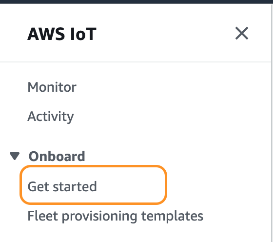

# Ubuntu LTS 20.04

```sh
chmod 400 kio-nft-remote-kp.pem
ssh -i "kio-nft-remote-kp.pem" ubuntu@ec2-54-165-219-60.compute-1.amazonaws.com
 ```
# zsh
- https://geekytheory.com/como-instalar-oh-my-zsh-en-ubuntu
  
```sh
sudo apt-get install zsh
sudo apt-get install git-core
wget https://github.com/robbyrussell/oh-my-zsh/raw/master/tools/install.sh -O - | zsh
chsh -s `which zsh`
sudo chsh -s `which zsh`
```

# Node JS

## Install
https://www.digitalocean.com/community/tutorials/how-to-install-node-js-on-ubuntu-20-04

```sh
sudo apt update
sudo apt install nodejs
sudo apt install npm
```

 # git node init

 ```sh
git clone https://github.com/robin8a/kio-smart-contracts-iot-remote.git
npm install
 ```

 # AWS IoT
- [aws-iot](https://github.com/aws/aws-iot-device-sdk-js)
- [iot](https://dev.to/vic3king/how-to-control-an-iot-device-using-aws-in-a-node-js-application-21dh)
- [With VM](https://docs.aws.amazon.com/iot/latest/developerguide/creating-a-virtual-thing.html)

## Some prerequisites to consider: (AWS)
- the device should have Node.js and NPM installed and a TCP connection to the public internet on port 8883.
- EC2 instance add to security group rule TCP custom (0.0.0.0/0)
- Create the IoT device in the same region Ex. us-east
- name: kio-smart-contracts-iot-device

## Contabo
- Open firewall on Ubuntu 20.04
```sh
# Rule
sudo ufw allow proto tcp from any to any port 8883
# Status
sudo ufw status

Status: active

# To                         Action      From
# --                         ------      ----
# 3006/tcp                   LIMIT       Anywhere                  
# 6000/tcp                   ALLOW       Anywhere                  
# 8883/tcp                   ALLOW       Anywhere                  
# 3006/tcp (v6)              LIMIT       Anywhere (v6)             
# 6000/tcp (v6)              ALLOW       Anywhere (v6)             
# 8883/tcp (v6)              ALLOW       Anywhere (v6) 
```

# Upload file to EC2

## Filezilla
- [How To Upload And Download Files In Amazon AWS EC2 Instance](https://comtechies.com/how-to-upload-and-download-files-in-amazon-aws-ec2-instance.html)

### .pem to .ppk
- [puttygen mykey.pem -o mykey.ppk](https://stackoverflow.com/questions/37286791/convert-pem-to-ppk-on-macos)
  
```sh
# puttygen
puttygen mykey.pem -o mykey.ppk
puttygen kio-nft-remote-kp.pem -o kio-nft-remote-kp.ppk
```

## Upload File Using SCP Command Line Utility

```sh
# Let’s have a look at the syntax.

scp -i /path/to/key.pem file-name user@server-ip:/path/to/user/home
# For example,

scp -i /keys/mykey.pem file.txt ubuntu@54.34.45.23:/home/ubuntu 
# If you want to copy a whole folder, then you should use a recursive flag -r with the command as shown below.

scp -i /keys/mykey.pem -r folder-name ubuntu@54.34.45.23:/home/ubuntu 
```


## To configure and test the device, perform the following steps.

```sh
# Step 1: Unzip the connection kit on the device
unzip connect_device_package.zip
# Step 2: Add execution permissions
chmod +x start.sh
# Step 3: Run the start script. Messages from your thing will appear below
./start.sh
# Waiting for messages from your device
```

## IoT Core

### Setup new device



```json
{
  "motorid": "Fulton-A32",
  "sensorData": {
    "pressure": 23,
    "temperature": 47
  }
}


{
  "Command_From_UI": { command: "ls"}
}

{
  "Command_From_UI": {
    "command": "ls -al"
  }
}
```

# Front End
- [amplify](https://docs.amplify.aws/lib/pubsub/getting-started/q/platform/js#step-1-create-iam-policies-for-aws-iot)


# Cardano CLI npm 

[Cardano CLI](https://www.npmjs.com/package/cardanocli-js)

```sh
git clone https://github.com/Berry-Pool/cardanocli-js.git 
```

# Node JS debugger
[Debugger](https://nodejs.org/api/debugger.html)

## Test
```sh
node inspect app_two.js 
repl
```

# Waller Creation

```json
Message received 
{provider: AWSIoTProvider, value: {…}}
provider: AWSIoTProvider {_config: {…}, _clientsQueue: ClientsQueue, _topicObservers: Map(1), _clientIdObservers: Map(1)}
value:
name: "Test_0958"
payment: {addr: "/home/luisr/testnet/priv/wallet/Test_0958/Test_0958.payment.addr", skey: "/home/luisr/testnet/priv/wallet/Test_0958/Test_0958.payment.skey", vkey: "/home/luisr/testnet/priv/wallet/Test_0958/Test_0958.payment.vkey"}
paymentAddr: "addr_test1qrleh5h8gzu9knaflmqyz762cc6npw949cqhmahss73d4qw8efl2d2gxsqp95khr20ctecwdyzs950987crj69eug09svnklcz"
stake: {addr: "/home/luisr/testnet/priv/wallet/Test_0958/Test_0958.stake.addr", skey: "/home/luisr/testnet/priv/wallet/Test_0958/Test_0958.stake.skey", vkey: "/home/luisr/testnet/priv/wallet/Test_0958/Test_0958.stake.vkey"}
stakingAddr: "stake_test1urru5l4x4yrgqqj6tt348u9uu8xjpgz68jnlvpedzu7y8jcw9ja8y"
Symbol(topic): "topic_2"
__proto__: Object
__proto__: Object
```

# Deamon PM2
[How To Set Up a Node.js Application for Production on Ubuntu 18.04](https://www.digitalocean.com/community/tutorials/how-to-set-up-a-node-js-application-for-production-on-ubuntu-18-04)
