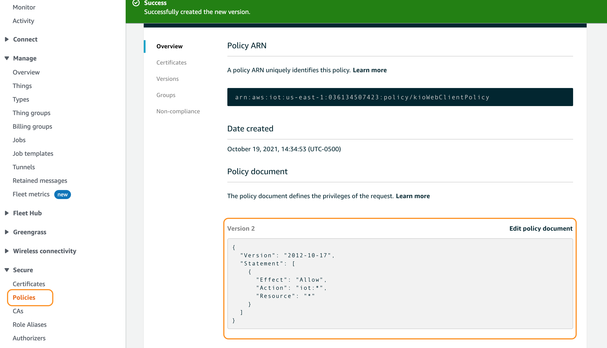
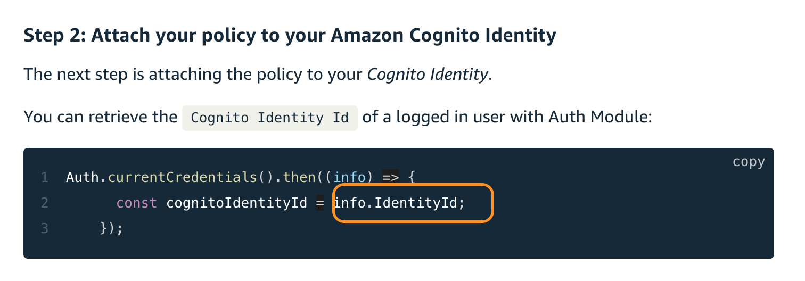

# Remote exec with React
- https://stackoverflow.com/questions/46536667/how-do-i-execute-system-scripts-from-within-a-reactjs-project
- https://medium.com/technoetics/how-to-create-in-browser-terminal-using-react-and-nodejs-e923b5f9d28f
- https://www.npmjs.com/package/remote-exec
- https://morioh.com/p/5f77a8cb3c59
- https://stackabuse.com/executing-shell-commands-with-node-js/
- https://medium.com/stackfame/how-to-run-shell-script-file-or-command-using-nodejs-b9f2455cb6b7    
- https://itnext.io/how-to-auto-deploy-your-app-with-one-command-12f9ac00d34a
- https://zaiste.net/posts/few-ways-to-execute-commands-remotely-ssh/


# su-amazing-leads-roisense
- [Amplify Getting Started](https://docs.amplify.aws/start)

# Starting React App

```sh
source ~/.bash_profile
npx create-react-app kio-smart-contract-rjs-app
```

# Amplify

## configure

- Just when is a new aws account
```sh
amplify configure


# Follow these steps to set up access to your AWS account:

# Sign in to your AWS administrator account:
# https://console.aws.amazon.com/
# Press Enter to continue

# Specify the AWS Region
# ? region:  us-east-1
# Specify the username of the new IAM user:
# ? user name:  kio-suan-amplify
# Complete the user creation using the AWS console
# https://console.aws.amazon.com/iam/home?region=undefined#/users$new?step=final&accessKey&userNames=kio-suan-amplify&permissionType=policies&policies=arn:aws:iam::aws:policy%2FAdministratorAccess
# Press Enter to continue

# Enter the access key of the newly created user:
# ? accessKeyId:  AKIAQQ2OI2**********
# ? secretAccessKey:  HTE0liK8QkJjWI+dnzGi********************
# This would update/create the AWS Profile in your local machine
# ? Profile Name:  suan-blockchain
```


## init

```sh
amplify init

# Note: It is recommended to run this command from the root of your app directory
# ? Enter a name for the project kiosmartcontractrjsa
# ? Enter a name for the environment kismtcoenv
# ? Choose your default editor: Visual Studio Code
# ? Choose the type of app that you're building javascript
# Please tell us about your project
# ? What javascript framework are you using react
# ? Source Directory Path:  src
# ? Distribution Directory Path: build
# ? Build Command:  npm run-script build
# ? Start Command: npm run-script start
# Using default provider  awscloudformation

# For more information on AWS Profiles, see:
# https://docs.aws.amazon.com/cli/latest/userguide/cli-multiple-profiles.html

# ? Do you want to use an AWS profile? Yes
# ? Please choose the profile you want to use suan-blockchain
# Adding backend environment kismtcoenv to AWS Amplify Console app: d2exgrisng6lf0
# ⠴ Initializing project in the cloud...

# CREATE_IN_PROGRESS amplify-kiosmartcontractrjsa-kismtcoenv-113353 AWS::CloudFormation::Stack Tue Oct 19 2021 11:33:57 GMT-0500 (Colombia Standard Time) User Initiated
# ⠏ Initializing project in the cloud...

# CREATE_IN_PROGRESS AuthRole   AWS::IAM::Role Tue Oct 19 2021 11:34:02 GMT-0500 (Colombia Standard Time) 
# CREATE_IN_PROGRESS UnauthRole AWS::IAM::Role Tue Oct 19 2021 11:34:02 GMT-0500 (Colombia Standard Time) 
# ⠼ Initializing project in the cloud...

# CREATE_IN_PROGRESS AuthRole         AWS::IAM::Role  Tue Oct 19 2021 11:34:04 GMT-0500 (Colombia Standard Time) Resource creation Initiated
# CREATE_IN_PROGRESS DeploymentBucket AWS::S3::Bucket Tue Oct 19 2021 11:34:04 GMT-0500 (Colombia Standard Time) Resource creation Initiated
# CREATE_IN_PROGRESS UnauthRole       AWS::IAM::Role  Tue Oct 19 2021 11:34:03 GMT-0500 (Colombia Standard Time) Resource creation Initiated
# CREATE_IN_PROGRESS DeploymentBucket AWS::S3::Bucket Tue Oct 19 2021 11:34:03 GMT-0500 (Colombia Standard Time)                            
# ⠼ Initializing project in the cloud...

# CREATE_COMPLETE AuthRole   AWS::IAM::Role Tue Oct 19 2021 11:34:18 GMT-0500 (Colombia Standard Time) 
# CREATE_COMPLETE UnauthRole AWS::IAM::Role Tue Oct 19 2021 11:34:17 GMT-0500 (Colombia Standard Time) 
# ⠼ Initializing project in the cloud...

# CREATE_COMPLETE DeploymentBucket AWS::S3::Bucket Tue Oct 19 2021 11:34:25 GMT-0500 (Colombia Standard Time) 
# ✔ Successfully created initial AWS cloud resources for deployments.


# CREATE_COMPLETE amplify-kiosmartcontractrjsa-kismtcoenv-113353 AWS::CloudFormation::Stack Tue Oct 19 2021 11:34:27 GMT-0500 (Colombia Standard Time) 
# ✔ Initialized provider successfully.
# Initialized your environment successfully.

# Your project has been successfully initialized and connected to the cloud!

# Some next steps:
# "amplify status" will show you what you've added already and if it's locally configured or deployed
# "amplify add <category>" will allow you to add features like user login or a backend API
# "amplify push" will build all your local backend resources and provision it in the cloud
# “amplify console” to open the Amplify Console and view your project status
# "amplify publish" will build all your local backend and frontend resources (if you have hosting category added) and provision it in the cloud

# Pro tip:
# Try "amplify add api" to create a backend API and then "amplify publish" to deploy everything

```

# Codecommit

[Create repo](https://docs.aws.amazon.com/cli/latest/reference/codecommit/create-repository.html)
```sh
nano ~/.aws/credentials
export PATH=~/Library/Python/3.8/bin:$PATH
# source ~/.bash_profile
# test
aws s3 ls --profile suan-blockchain
export AWS_PROFILE=suan-blockchain

# aws codecommit create-repository --repository-name MyDemoRepo --repository-description "My demonstration repository" --tags Team=Saanvi
aws codecommit create-repository --repository-name kio-smart-contract-rjs-app --repository-description "Cardano Smart Contracts" --tags Team=kio --region us-east-1 

```

## result
```json
{
    "repositoryMetadata": {
        "accountId": "036134507423",
        "repositoryId": "92be7bbd-c5de-40f6-86bc-2cb801698d6e",
        "repositoryName": "kio-smart-contract-rjs-app",
        "repositoryDescription": "Cardano Smart Contracts",
        "lastModifiedDate": 1634661585.3,
        "creationDate": 1634661585.3,
        "cloneUrlHttp": "https://git-codecommit.us-east-1.amazonaws.com/v1/repos/kio-smart-contract-rjs-app",
        "cloneUrlSsh": "ssh://git-codecommit.us-east-1.amazonaws.com/v1/repos/kio-smart-contract-rjs-app",
        "Arn": "arn:aws:codecommit:us-east-1:036134507423:kio-smart-contract-rjs-app"
    }
}
```


# git

```sh
ssh-keygen
/Users/robin8a/.ssh/kio_smart_contracts_rsa

cat ~/.ssh/kio_smart_contracts_rsa.pub

```


```sh
cd ~/.ssh
ls
nano config

# Add

# CodeCommit hosts
Host kio_smart_contracts_rsa
   HostName git-codecommit.us-east-1.amazonaws.com
   User APKAQQ2OI2OP7JF47SHB
   IdentityFile ~/.ssh/kio_smart_contracts_rsa

```

https://xiaolishen.medium.com/use-multiple-ssh-keys-for-different-github-accounts-on-the-same-computer-7d7103ca8693

```sh
# git remote -v
# git remote rm origin
# Using the same kio_indoor_emap_rsa because is on the same account
git remote add origin ssh://kio_smart_contracts_rsa/v1/repos/kio-smart-contract-rjs-app
git push

git clone ssh://aws_commit_smart_kio_rsa/v1/repos/kio-smart-contract-rjs-app
```


# Install libraries
```sh
npm install react-bootstrap bootstrap
npm i react-external-link
npm i react-router-dom
npm i aws-amplify @aws-amplify/ui-react
npm i aws-amplify-react
npm i --save react-select
npm i styled-components
npm i uuid
```


# Amplify hosting
```sh
`amplify add hosting`
```
## Result
```sh

amplify add hosting
# ? Select the plugin module to execute Hosting with Amplify Console (Managed hosting with custom domains, Continuous deployment)
# ? Choose a type Continuous deployment (Git-based deployments)
# ? Continuous deployment is configured in the Amplify Console. Please hit enter once you connect your repository 
# Amplify hosting urls: 
┌──────────────┬──────────────────────────────────────────────┐
│ FrontEnd Env │ Domain                                       │
├──────────────┼──────────────────────────────────────────────┤
│ master       │ https://master.d2exgrisng6lf0.amplifyapp.com │
└──────────────┴──────────────────────────────────────────────┘
```

# Amplify auth

```sh
amplify add auth
# Using service: Cognito, provided by: awscloudformation
 
#  The current configured provider is Amazon Cognito. 
 
#  Do you want to use the default authentication and security configuration? Default configuration
#  Warning: you will not be able to edit these selections. 
#  How do you want users to be able to sign in? Username
#  Do you want to configure advanced settings? No, I am done.
# Successfully added resource kiosmartcontractrjsae65b634c locally

# Some next steps:
# "amplify push" will build all your local backend resources and provision it in the cloud
# "amplify publish" will build all your local backend and frontend resources (if you have hosting category added) and provision it in the cloud
```

# Amplify push

```sh
amplify push
```

# Credentails


# Amplify pub and sub example with React

- [Follow this intructions: ***works*** Amplify PUBSUB Getting started](https://docs.amplify.aws/lib/pubsub/getting-started/q/platform/js)
- https://docs.amplify.aws/lib/pubsub/getting-started/q/platform/js
- [aws named profiles](https://docs.aws.amazon.com/cli/latest/userguide/cli-configure-profiles.html)
- [aws-amplify-react-iot-pub-sub-demo](https://github.com/matwerber1/aws-amplify-react-iot-pub-sub-demo)
- [Get cognito Identity Id](https://docs.aws.amazon.com/cognitoidentity/latest/APIReference/API_GetId.html)
- https://techdocs.broadcom.com/us/en/ca-enterprise-software/layer7-api-management/mobile-api-gateway/4-2/solutions-and-integrations/aws-iot-for-messaging.html
- https://www.youtube.com/watch?v=j2KJVHGHaFc
- https://aws.amazon.com/blogs/iot/configuring-cognito-user-pools-to-communicate-with-aws-iot-core/
- https://docs.aws.amazon.com/iot/latest/developerguide/attach-to-cert.html


# Attach the policy
- Follow this [oficial tutorial](https://docs.amplify.aws/lib/pubsub/getting-started/q/platform/js/#step-1-create-iam-policies-for-aws-iot)
- But...

## Create the policy like this



```js
{
  "Version": "2012-10-17",
  "Statement": [
    {
      "Effect": "Allow",
      "Action": "iot:*",
      "Resource": "*"
    }
  ]
}
```

## To get <YOUR_COGNITO_IDENTITY_ID>  
- The tutorial has two errors


```jsx
import Amplify, { PubSub, Auth } from 'aws-amplify'

componentDidMount = async () => {
        
        Auth.currentCredentials().then((info) => {
            const cognitoIdentityId = info.identityId;
            console.log('cognitoIdentityId: ', cognitoIdentityId)
          });
}
```
```sh

export PATH=~/Library/Python/3.7/bin:$PATH
source ~/.bash_profile


# Check profiles
nano ~/.aws/config

# kio-indoor-emap
export AWS_PROFILE=kio-indoor-emap


# Simple command
aws ec2 describe-instances --profile lemon-wifi

# or for multiples commands
export AWS_PROFILE=kio-indoor-emap

aws iot attach-principal-policy --policy-name 'ReactIoTPolicy' --principal '<YOUR_COGNITO_IDENTITY_ID>' 
aws iot attach-principal-policy --policy-name 'ReactIoTPolicy' --principal 'us-east-1:fd6f28e9-4b12-4739-a54d-d52c281bd4b4'
aws iot attach-principal-policy --policy-name ReactIoTPolicy --principal us-east-1:fd6f28e9-4b12-4739-a54d-d52c281bd4b4

aws iot attach-policy --policy-name 'kioWebClientPolicy' --target 'us-east-1:7b8ee83d-263e-4433-847f-dadd60b20b99'

aws iot attach-principal-policy --policy-name 'kioWebClientPolicy' --principal us-east-1:7b8ee83d-263e-4433-847f-dadd60b20b99

# This works!
aws iot attach-principal-policy --policy-name 'kioWebClientPolicy' --principal 'us-east-1:7b8ee83d-263e-4433-847f-dadd60b20b99'
```


## Policy Test 
[Policy AWS Simulator](https://policysim.aws.amazon.com)
Ex: arn:aws:iam::879105828344:role/kl-lwf-amp-dev-20190703114204-authRole


# amplify storage
```sh
amplify add storage
# Scanning for plugins...
# Plugin scan successful
# ? Please select from one of the below mentioned services: Content (Images, audio, vide
# o, etc.)
# ? Please provide a friendly name for your resource that will be used to label this cat
# egory in the project: s3bf54301f
# ? Please provide bucket name: kio-smart-contracts-ipfs
# ? Who should have access: Auth and guest users
# ? What kind of access do you want for Authenticated users? create/update, read
# ? What kind of access do you want for Guest users? create/update, read
# ? Do you want to add a Lambda Trigger for your S3 Bucket? Yes
# ? Select from the following options 
# ❯ Choose an existing function from the project 
#   Create a new function 
# ➜  kio-smart-contract-rjs-app git:(development) amplify add storage
# ? Please select from one of the below mentioned services: Content (Images, audio, vide
# o, etc.)
# ? Please provide a friendly name for your resource that will be used to label this cat
# egory in the project: s307b7a237
# ? Please provide bucket name: kio-smart-contracts-ipfs
# ? Who should have access: Auth and guest users
# ? What kind of access do you want for Authenticated users? create/update, read
# ? What kind of access do you want for Guest users? create/update, read
# ? Do you want to add a Lambda Trigger for your S3 Bucket? No
# Successfully updated auth resource locally.
# Successfully added resource s307b7a237 locally

# Some next steps:
# "amplify push" builds all of your local backend resources and provisions them in the cloud
# "amplify publish" builds all of your local backend and front-end resources (if you added hosting category) and provisions them in the cloud
```

# Amplify PubSub QoS
- https://aws-amplify.github.io/aws-sdk-ios/docs/reference/AWSIoT/Classes/AWSIoTDataManager.html
- https://aws-amplify.github.io/amplify-js/api/
- https://github.com/matwerber1/aws-amplify-react-iot-pub-sub-demo


# When to use ES6 class based React components vs. functional ES6 React components?

- https://stackoverflow.com/questions/36097965/when-to-use-es6-class-based-react-components-vs-functional-es6-react-components


# Amplify API

```sh
amplify add api    
# Scanning for plugins...
# Plugin scan successful
# ? Please select from one of the below mentioned services: GraphQL
# ? Provide API name: kiosmartcontractrjsa
# ? Choose the default authorization type for the API Amazon Cognito User Pool
# Use a Cognito user pool configured as a part of this project.
# ? Do you want to configure advanced settings for the GraphQL API No, I am done.
# ? Do you have an annotated GraphQL schema? No
# ? Do you want a guided schema creation? Yes
# ? What best describes your project: Objects with fine-grained access control (e.g., a project manageme
# nt app with owner-based authorization)
# ? Do you want to edit the schema now? Yes
# Please edit the file in your editor: /Users/robin8a/Documents/react_ws/kio-smart-contract-rjs-app/amplify/backend/api/kiosmartcontractrjsa/schema.graphql
# ? Press enter to continue 

# The following types do not have '@auth' enabled. Consider using @auth with @model
#          - User
#          - Wallet
# Learn more about @auth here: https://aws-amplify.github.io/docs/cli-toolchain/graphql#auth 


# GraphQL schema compiled successfully.

# Edit your schema at /Users/robin8a/Documents/react_ws/kio-smart-contract-rjs-app/amplify/backend/api/kiosmartcontractrjsa/schema.graphql or place .graphql files in a directory at /Users/robin8a/Documents/react_ws/kio-smart-contract-rjs-app/amplify/backend/api/kiosmartcontractrjsa/schema
# Successfully added resource kiosmartcontractrjsa locally

# Some next steps:
# "amplify push" will build all your local backend resources and provision it in the cloud
# "amplify publish" will build all your local backend and frontend resources (if you have hosting category added) and provision it in the cloud
```


Wallet 1616 2710 (Tiene plata)
4d853bbb6756b9bbfd3d081ca0def9a59a4cba85
Uwwx59xAH19r`2$4
c4rd4n02021

Destino
addr_test1qre6dnhs8w9xa2efs02lww567rsyglj7a2pr8zv296wwuty0ygqtcgd0dl274tc88hu6h4vky8e5yczgq48ff28xc7kqpsypc0

```json
{
    "seq": 1,
    "cmd_id": "min_fees",
    "message": {
            "id": "2781d44e82ad834750c8fd2654faccd2db912eaa",
            "tx_info": {
            "payments": [
            {
                "address": "addr_test1qp09lnuch5vgswuxcjlta78mlp88taudhgymyktu3qy44pk8tuvg9dmy75z2dpj0e4kzw642e3hpjt937e4t3jun3l3sftz57e",
                "amount": {
                    "quantity": 5000000,
                    "unit": "lovelace"
                },
                "assets": null
            }
            ],
            "metadata": null
        }
    }
}

// Error: not_enough_money
{ "seq": 1, "cmd_id": "min_fees", "message": { "id": "2781d44e82ad834750c8fd2654faccd2db912eaa", "tx_info": { "payments": [ {"address": "addr_test1qp09lnuch5vgswuxcjlta78mlp88taudhgymyktu3qy44pk8tuvg9dmy75z2dpj0e4kzw642e3hpjt937e4t3jun3l3sftz57e", "amount": { "quantity": 5000000, "unit": "lovelace" }, "assets": null } ],"metadata": null } } }

// Error: bad_request
{ "seq": 1, "cmd_id": "min_fees", "message": { "id": "2781d44e82ad834750c8fd2654faccd2db912eaa", "tx_info": { "payments": [ {"address": "addr_test1qp09lnuch5vgswuxcjlta78mlp88taudhgymyktu3qy44pk8tuvg9dmy75z2dpj0e4kzw642e3hpjt937e4t3jun3l3sftz57ea", "amount": { "quantity": 5000000, "unit": "lovelace" }, "assets": null } ],"metadata": null } } }

// Working
{ "seq": 1, "cmd_id": "min_fees", "message": { "id": "4d853bbb6756b9bbfd3d081ca0def9a59a4cba85", "tx_info": { "payments": [ {"address": "addr_test1qre6dnhs8w9xa2efs02lww567rsyglj7a2pr8zv296wwuty0ygqtcgd0dl274tc88hu6h4vky8e5yczgq48ff28xc7kqpsypc0", "amount": { "quantity": 5000000, "unit": "lovelace" }, "assets": null } ],"metadata": null } } }


addr_test1qre6dnhs8w9xa2efs02lww567rsyglj7a2pr8zv296wwuty0ygqtcgd0dl274tc88hu6h4vky8e5yczgq48ff28xc7kqpsypc0


// Working

{
    "seq": 1,
    "cmd_id": "send_transaction",
    "passphrase":"c4rd4n02021",
    "message": {
            "id": "4d853bbb6756b9bbfd3d081ca0def9a59a4cba85",
            "tx_info": {
            "payments": [
            {
                "address": "addr_test1qre6dnhs8w9xa2efs02lww567rsyglj7a2pr8zv296wwuty0ygqtcgd0dl274tc88hu6h4vky8e5yczgq48ff28xc7kqpsypc0",
                "amount": {
                    "quantity": 5000000,
                    "unit": "lovelace"
                },
                "assets": null
            }
            ],
            "metadata": null
        }
    }
}

{ "seq": 1, "cmd_id": "send_transaction", "passphrase": "c4rd4n02021", "message": { "id": "4d853bbb6756b9bbfd3d081ca0def9a59a4cba85",
"tx_info": { "payments": [ {"address": "addr_test1qre6dnhs8w9xa2efs02lww567rsyglj7a2pr8zv296wwuty0ygqtcgd0dl274tc88hu6h4vky8e5yczgq48ff28xc7kqpsypc0", "amount": { "quantity": 5000000, "unit": "lovelace"}, "assets": null } ], "metadata": null } } }


```

name: WorkingWallet
c4rd4n02021
af807b9bf120667b5fadd9e7bdee4a6dab71623f

```json
{
    "seq": 1,
    "cmd_id": "send_transaction",
    "passphrase": "c4rd4n02021",
    "message": {
            "id": "af807b9bf120667b5fadd9e7bdee4a6dab71623f",
            "tx_info": {
            "payments": [
            {
                "address": "addr_test1qqerujexjrf8tq0kfd5altskyju8dzhhytxkdvvj68nu0yxspala4cjnzr4rxwxnsh34p0l5pynhv89ntnm8xsw2ggnqzqe9kh",
                "amount": {
                    "quantity": 5000000,
                    "unit": "lovelace"
                },
                "assets": null
            }
            ],
            "metadata": null
        }
    }
}


{
        "seq": 1,
        "cmd_id": "send_transaction",
        "message": {
            "id": "af807b9bf120667b5fadd9e7bdee4a6dab71623f",
            "tx_info": {
                "passphrase": "c4rd4n02021",
                "payments": [
                    {
                        "address": "addr_test1qre6dnhs8w9xa2efs02lww567rsyglj7a2pr8zv296wwuty0ygqtcgd0dl274tc88hu6h4vky8e5yczgq48ff28xc7kqpsypc0",
                        "amount": {
                            "quantity": 5000000,
                            "unit": "lovelace"
                        },
                        "assets": null
                    }
                ],
                "metadata": null
            }
        }
}
```


1. GraphQL User and Wallet con Create Wallet [X]
2. Clean [X]
3. Mostrar la creacion de la billetera, info basica [X]
4. No permitir Add si no esta suscrito
5. Gestionar multiusuario


# Tim Tempalte
## Dependencies
```sh
npm i nouislider
npm i react-datetime
npm i reactstrap
npm i moment
```


I$t1234LuisTest

# Tx Send Working

```json
{"client_id": "test-58b14a35-2b50-4da4-9170-55405da1b74e", "tx_result": {"status": "pending", "withdrawals": [], "amount": {"quantity": 2171397, "unit": "lovelace"}, "inputs": [{"amount": {"quantity": 1000000000, "unit": "lovelace"}, "address": "addr_test1qzs8055h8zse40wj98vpxfd55r7ynmte8r92gaunrf0tkn0r2rpucu0ce409mjfp839rt4cugud3y0taynetjd5hkc6scs9w0r", "id": "26d412bb4be31e2866958568fd9b1cc3530ecc27be5cc87a16d68f3b9479a8da", "assets": [], "index": 0}], "direction": "outgoing", "fee": {"quantity": 171397, "unit": "lovelace"}, "outputs": [{"amount": {"quantity": 2000000, "unit": "lovelace"}, "address": "addr_test1qq4ymgg025zh8lyca7ye6q43juuh5935ufselpl5lq0pw793kuwvxka9yuyd39sws3fetwgapxggm72ymvh62z292dwq4pdjf5", "assets": []}, {"amount": {"quantity": 997828603, "unit": "lovelace"}, "address": "addr_test1qqlf8yxh624vrnd3tgwf8hvwkxn4gyhl4af0sydfursuwvhr2rpucu0ce409mjfp839rt4cugud3y0taynetjd5hkc6spte4dt", "assets": []}], "script_validity": "valid", "expires_at": {"time": "2021-12-10T20:07:31Z", "epoch_number": 173, "absolute_slot_number": 44797635, "slot_number": 431235}, "pending_since": {"height": {"quantity": 3142728, "unit": "block"}, "time": "2021-12-10T20:04:28Z", "epoch_number": 173, "absolute_slot_number": 44797452, "slot_number": 431052}, "metadata": {"1337": {"map": [{"k": {"string": "message"}, "v": {"string": "Tx1506"}}]}}, "id": "28aa0b8ab99f43ad4f853f5d05e0ea7c6a41547adfe2ce3e55229bb7db37bd47", "deposit": {"quantity": 0, "unit": "lovelace"}, "collateral": [], "mint": []}}
```

# Mint Working

<!-- ToDo Sacar el Policy ID y guardarlo en la Billetera en BD de nosotros-->
```json
{"client_id": "test-5be2aa0c-19ef-469c-a934-c2703742b9da", "tx_result": {"message": {"policyid": "45ec3b1f571ec2f9165f34573c0445d886283eb28ee32127aa59a88a", "asset_name": "Wallet1529", "quantity_mint": 10, "fees": 183145, "destination_address": "addr_test1qrex6ccvucju3xrxqewjwv5szd4qdzf4wu8rkp39me633t43kuwvxka9yuyd39sws3fetwgapxggm72ymvh62z292dwqhf8nve", "metadata": {}, "policy_script": {"keyHash": "bda4f9c08d0992a37b032b4baf8847e9e980f4d05799d9417786a9ed", "type": "sig"}}, "code": "Mint\u00a1\u00a1"}}
```

# 

<!-- Todo -->
```json
{"client_id": "test-5be2aa0c-19ef-469c-a934-c2703742b9da", "wallet_info": {"passphrase": {"last_updated_at": "2021-12-10T19:57:04.706033884Z"}, "address_pool_gap": 20, "state": {"status": "ready"}, "balance": {"reward": {"quantity": 0, "unit": "lovelace"}, "total": {"quantity": 11635514, "unit": "lovelace"}, "available": {"quantity": 11635514, "unit": "lovelace"}}, "name": "Luis12101456", "delegation": {"next": [], "active": {"status": "not_delegating"}}, "id": "d48f8ecfb43c7753d0dd61279e3e89c34f04bf57", "tip": {"height": {"quantity": 3142778, "unit": "block"}, "time": "2021-12-10T20:32:46Z", "epoch_number": 174, "absolute_slot_number": 44799150, "slot_number": 750}, "assets": {"total": [{"asset_name": "4c7569733132313031343536", "quantity": 10, "policy_id": "3b0cd71449d5b17a566ae7e639705261a336b896f43feff010e319a4"}, {"asset_name": "57616c6c657431353239", "quantity": 10, "policy_id": "45ec3b1f571ec2f9165f34573c0445d886283eb28ee32127aa59a88a"}], "available": [{"asset_name": "4c7569733132313031343536", "quantity": 10, "policy_id": "3b0cd71449d5b17a566ae7e639705261a336b896f43feff010e319a4"}, {"asset_name": "57616c6c657431353239", "quantity": 10, "policy_id": "45ec3b1f571ec2f9165f34573c0445d886283eb28ee32127aa59a88a"}]}}, "address": [{"state": "unused", "id": "addr_test1qqkrcr8a0r5hl6u8ajzayh9gusxa4vspc39wq6aaa2ead493kuwvxka9yuyd39sws3fetwgapxggm72ymvh62z292dwqsck4jy", "derivation_path": ["1852H", "1815H", "0H", "0", "2"]}, {"state": "unused", "id": "addr_test1qzgygnack935nl6c2k9fumn3xzgv0elfg7kht8afyz87x0a3kuwvxka9yuyd39sws3fetwgapxggm72ymvh62z292dwqx5mnlq", "derivation_path": ["1852H", "1815H", "0H", "0", "3"]}, {"state": "unused", "id": "addr_test1qzujgs3m2ppfh2gxs5yfys0qm9pqhg3ha9c9fl02ml04f3d3kuwvxka9yuyd39sws3fetwgapxggm72ymvh62z292dwq4hyj7e", "derivation_path": ["1852H", "1815H", "0H", "0", "4"]}, {"state": "unused", "id": "addr_test1qqskj05n3lm9kff3jw537hd09q7wf9kc07nfcxwr7r8xf593kuwvxka9yuyd39sws3fetwgapxggm72ymvh62z292dwq907tyd", "derivation_path": ["1852H", "1815H", "0H", "0", "5"]}, {"state": "unused", "id": "addr_test1qzxeaq4h8hsh28hm2edh2ltg6uly3zv7aj0qzduaytkfhja3kuwvxka9yuyd39sws3fetwgapxggm72ymvh62z292dwqqmn8xv", "derivation_path": ["1852H", "1815H", "0H", "0", "6"]}, {"state": "unused", "id": "addr_test1qrva0kd4s8zfphsyu4h5g6taalg6hh254d4264yjnm6fx593kuwvxka9yuyd39sws3fetwgapxggm72ymvh62z292dwqgs8kau", "derivation_path": ["1852H", "1815H", "0H", "0", "7"]}, {"state": "unused", "id": "addr_test1qrlqp8tv27pgqjgeqxlgxrjt5r2k3n6yck38cjp6jlvyzfa3kuwvxka9yuyd39sws3fetwgapxggm72ymvh62z292dwqzuagmr", "derivation_path": ["1852H", "1815H", "0H", "0", "8"]}, {"state": "unused", "id": "addr_test1qqd76cgswez6a8lzgj5nuqe8nzxwp3d5ueqnj42ft553w6d3kuwvxka9yuyd39sws3fetwgapxggm72ymvh62z292dwquy6rqf", "derivation_path": ["1852H", "1815H", "0H", "0", "9"]}, {"state": "unused", "id": "addr_test1qpnzy86y2y5a63lnsg59j2frrtl889j9pjn9w82xt0kx6va3kuwvxka9yuyd39sws3fetwgapxggm72ymvh62z292dwqdxuu8j", "derivation_path": ["1852H", "1815H", "0H", "0", "10"]}, {"state": "unused", "id": "addr_test1qpyl7gd9aqz87j47hxhj0mn7dm4angc3gryhmflg8nq8uzd3kuwvxka9yuyd39sws3fetwgapxggm72ymvh62z292dwql2q5ue", "derivation_path": ["1852H", "1815H", "0H", "0", "11"]}, {"state": "unused", "id": "addr_test1qz6wrk7emg46z8lgumlmxqng3hk6qwkxk829wmee2u5c9c43kuwvxka9yuyd39sws3fetwgapxggm72ymvh62z292dwqswq059", "derivation_path": ["1852H", "1815H", "0H", "0", "12"]}, {"state": "unused", "id": "addr_test1qq8m2jgexu8gwhaevtelerpdd7wjjftc0lzfzucdhtarmyd3kuwvxka9yuyd39sws3fetwgapxggm72ymvh62z292dwqvzwccu", "derivation_path": ["1852H", "1815H", "0H", "0", "13"]}, {"state": "unused", "id": "addr_test1qztl0nydg6hpjhcg33daxdajjgp425xydet9jsgc2fd4sp93kuwvxka9yuyd39sws3fetwgapxggm72ymvh62z292dwq89d0hu", "derivation_path": ["1852H", "1815H", "0H", "0", "14"]}, {"state": "unused", "id": "addr_test1qr6n83z7cm2p4rjj2rp6jxzm84lt4qd6n02wuljd3p589e43kuwvxka9yuyd39sws3fetwgapxggm72ymvh62z292dwq5mrdyl", "derivation_path": ["1852H", "1815H", "0H", "0", "15"]}, {"state": "unused", "id": "addr_test1qqdzexk9s7ta7ujvnymqjujzr5lg5v6yxgeq3095ujcalpd3kuwvxka9yuyd39sws3fetwgapxggm72ymvh62z292dwq2ptuf0", "derivation_path": ["1852H", "1815H", "0H", "0", "16"]}, {"state": "unused", "id": "addr_test1qpn486c5k7ltgt6zgt703syej9l37nqfgppdl8dvj7lzvmd3kuwvxka9yuyd39sws3fetwgapxggm72ymvh62z292dwqn6fwut", "derivation_path": ["1852H", "1815H", "0H", "0", "17"]}, {"state": "unused", "id": "addr_test1qre527hkdgq353pfkslfw5nu6r4zxlpqefgzl0v29t9d5r93kuwvxka9yuyd39sws3fetwgapxggm72ymvh62z292dwq2k4k2z", "derivation_path": ["1852H", "1815H", "0H", "0", "18"]}, {"state": "unused", "id": "addr_test1qzrap7qxuhql68070eammg8gskyfjscdnqrfxag55fhrhv93kuwvxka9yuyd39sws3fetwgapxggm72ymvh62z292dwqmsuhjh", "derivation_path": ["1852H", "1815H", "0H", "0", "19"]}, {"state": "unused", "id": "addr_test1qrtmsf8tcg7r75k9wpv2tjveqmzxf3hfj602p4ms40vwlr93kuwvxka9yuyd39sws3fetwgapxggm72ymvh62z292dwqrq5w2r", "derivation_path": ["1852H", "1815H", "0H", "0", "20"]}, {"state": "unused", "id": "addr_test1qpp25ufgh3yt0ct3tuq0tefl6fy4l7k9wv5xharwtf7uqa43kuwvxka9yuyd39sws3fetwgapxggm72ymvh62z292dwqg3lutz", "derivation_path": ["1852H", "1815H", "0H", "0", "21"]}]}
```

JhonnyWallet1555

addr_test1qrn8g0kmls85hk60le8v6t5hg4grmrfyan5kee9rfhlea2zz88h24c955t9dlqjwl8s898csaxy68uus7ekyy578hagqj9fgx6

WorkingWallet
c4rd4n02021


Uwwx59xAH19r`2$4
c4rd4n02021

WorkingWallet c4rd4n02021

# TestingWallet
## Phrase
aware patch chef ball orange hungry mother amateur immune denial bunker wrist zebra exist cushion oxygen patient blouse love baby target ghost nurse recipe
# Primary Address Info: unused | id: 
addr_test1qra90e83h636qk4z6zth54kknw49ulndqljvp039zvpqjgjvuz02am7w55rauvf3lh4yy2emmyuwwn33az6xv8plty5q5fqvw9
# pwd
TestingWallet/TestingWallet


# MintWallet
## Phrase
crack forum atom modify cupboard exile frost mule orphan move vendor harvest scale income someone stereo kitten crisp hurdle already chimney enforce remind come
# pwd
MintWallet/MintWallet
# Primary Address Info: unused | id: 
addr_test1qqze84lmfanx3yptlc0n54rtesccu4l5k8hvurycjftuxt60ckjmnhkzdzx434xatvcct8qk3jsmr9kxxqafvamu9hfq29gl4u
# ID: 
fb6c8a88a62ca537db15de4d799418c0a238c66b

TD71PQ